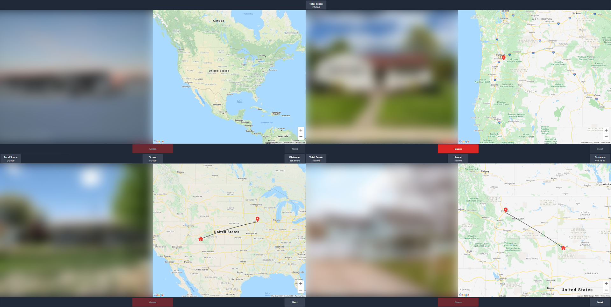

# Home Guesser :house::earth_americas:
A game based off GeoGuessr which shows images of houses from Zillow and asks the user to guess their location.

## About

*Note: Images are blurred here for copyright purposes, they are not blurred during actual gameplay.*

Home Guesser is a game inspired by [GeoGuessr](https://www.geoguessr.com/) which challenges the player to guess the location of houses scraped from the real-estate website [Zillow](https://www.zillow.com/). Since Zillow only provides U.S. listings, the game is currently limited to the 50 states + D.C.

## Usage

### Option 1 - Hosted
I am currently hosting Home Guesser on my personal [website](https://projects.dyscott.xyz/home-guesser). This is subject to change if demand increases (the Google Maps API is expensive).

### Option 2 - Self-Host (With Extension)

1. Get a Google Maps API Key [here](https://developers.google.com/maps/documentation/javascript/get-api-key).

2. Replace `YOUR_API_KEY` in `/dist/index.html` (near the bottom) with your Google Maps API Key.

3. Install a CORS extension to allow the web browser to scrape from Zillow without running into CORS errors. [CORS Unblock](https://chrome.google.com/webstore/detail/cors-unblock/lfhmikememgdcahcdlaciloancbhjino/related?hl=en) seems to work well for Chrome.

4. Host the files in the folder `/dist` using your choice of web server. Alternatively, you can just open the file `/dist/index.html` in a web browser.

### Option 3 - Self-Host (With Proxy)

1. Follow Steps 1 and 2 from Option 2.

2. Set up a CORS proxy. I would recommend using a Cloudflare Worker and [CORSFlare](https://github.com/Darkseal/CORSflare). Just make sure you change the hostname to `www.zillow.com`.

3. Replace `https://zillow.com/` in `/dist/js/house.js` with the URL of your CORS proxy.

4. Follow Step 4 from Option 2.

## Details

Here are some note-worthy details about the app:

- Uses a client-side web scraper. This makes the server-side extremely simple. All that is needed is a static web host (such as GitHub pages) and a CORS Proxy which can be run using any serverless platform.
- Uses the [Google Maps JavaScript API](https://developers.google.com/maps/documentation/javascript/overview). While this API is very expensive, since the map is only loaded once per session, it is at least somewhat cost effective.
- Uses [Tailwind CSS](https://tailwindcss.com/) for styling. 

## Building

If you want to make any changes to the styling, make sure you rebuild the CSS using the following command:

```npm run build```

## Improvements
This is primarily a proof-of-concept, so there is a lot of room for improvement:

- [ ] Improve scoring. Currently, it feels like it awards guesses too much and doesn't award precision enough.
- [ ] Switch from Zillow to an international real-estate site to add more variety. 
- [ ] Switch from Google Maps to a less expensive API such as OpenLayers which is free. 
- [ ] Make interface responsive. Currently, UI elements overlap on mobile.
